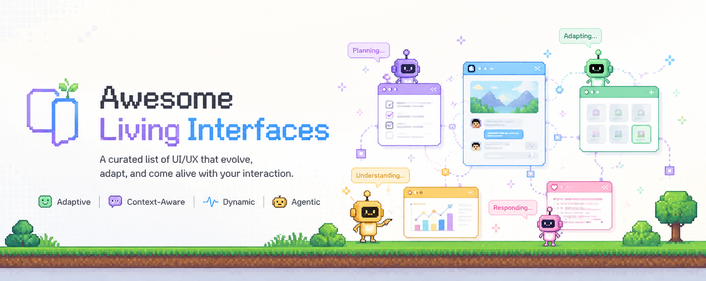

# Awesome Living Interfaces

**Living software:** tools that turn AI agents, systems, and activity into characters, worlds, and arenas instead of logs and dashboards.

 

## What is this?

A curated list of **verified** projects in the "living interface" space: tools that visualize agents, systems, or activity as **characters, worlds, or spatial arenas**, not plain logs, charts, or exchange homepages. Each entry was checked against GitHub, Product Hunt, Hacker News, Reddit, X, or the project's own site.

 

## Contents

- [Pixel Offices](#pixel-offices)
- [OpenClaw Ecosystem](#openclaw-ecosystem)
- [3D Worlds and Towns](#3d-worlds-and-towns)
- [Social Simulation Towns](#social-simulation-towns)
- [Combat and Strategy Arenas](#combat-and-strategy-arenas)
- [Security War Rooms](#security-war-rooms)
- [Fleet and Observability](#fleet-and-observability)
- [Checked, not included](#checked-not-included)
- [Rejected / unverified](#rejected--unverified)
- [Future schema](#future-schema)
- [Contributing](#contributing)
- [License](#license)

 

## Pixel Offices

> The most saturated category. Nearly everything here traces back to [Pixel Agents](https://github.com/pixel-agents-hq/pixel-agents) by Pablo De Lucca (r/ClaudeCode, Feb 2026), which spawned 15+ forks within months. The shared pattern: your coding agent becomes a pixel character that walks, sits, types, and pops a speech bubble when it needs approval.

### Origins and ports

- [Pixel Agents](https://github.com/pixel-agents-hq/pixel-agents) · The original (transferred from `pablodelucca`). VS Code extension + standalone CLI, sprite agents, office editor, multi-provider hooks. `Open Source`
- [Pixel Office (JetBrains)](https://plugins.jetbrains.com/plugin/31298) · IntelliJ port with 80+ furniture items and alien/cat/zoo themes. `Open Source`
- [pixel-agents-gemini](https://github.com/ajjamus/pixel-agents-gemini) · Gemini CLI variant. `Open Source`
- [pixel-agents-codex](https://github.com/MichaelMa907) · Codex variant. `Open Source`
- [pixel-agents-cursor](https://github.com/ananasDDA) · Cursor variant. `Open Source`
- [opencode-pixel-office](https://ddx-510.github.io/opencode-pixel-office) · OpenCode + Claude Code at once, mobile companion via QR. `Open Source`
- [pixel-agents (Cursor)](https://github.com/nicholasfrei/pixel-agents) · Cursor-specific VSIX fork of Pixel Agents. Install from GitHub Releases. `Open Source`

### Multi-agent visualizers

- [Ctrl (Cubicles)](https://bulletproof.sh/) · Pixel office for 7+ coding agents across VS Code, Cursor, Windsurf, and JetBrains. Token/cost tracking, session inspector, shareable web dashboard at [ctrl.bulletproof.sh](https://ctrl.bulletproof.sh). Install via [npm](https://www.npmjs.com/package/@bulletproof-sh/ctrl-daemon) or [VS Code Marketplace](https://marketplace.visualstudio.com/items?itemName=bulletproof-sh.ctrl). `Source Available` (no public GitHub repo)
- [Codemap](https://github.com/JamsusMaximus/codemap) · Agents as pixel characters in a hotel; folders become rooms, files become desks, arranged by git activity. `Open Source`
- [AgentMove](https://github.com/FoothillSolutions/agent-move) · Browser visualizer mapping tool calls to 9 activity zones. Supports Claude Code, OpenCode, Codex, and pi. `Open Source`
- [agent-town (library)](https://github.com/rafapetter/agent-town) · Framework-agnostic Canvas library with 7 themed environments (office, space station, pirate ship, town, etc.). `Open Source`
- [Pixel Office (Neolio42)](https://github.com/Neolio42/pixel-office) · Claude Code workers at desks with break room routing and browser approval for risky bash commands. `Open Source`
- [RoadBitOffice](https://github.com/BlackRoad-Forge/RoadBitOffice) · PixiJS pixel office for multi-agent collaboration with gateway daemon and mobile pair-code access. `Open Source`

### Offices and life sims

- [AgentOffice](https://github.com/harishkotra/agent-office) · Self-growing office where agents hire interns. Phaser + React, Ollama-powered, capped at 7 agents. `Open Source`
- [agents-in-the-office](https://github.com/gukosowa/agents-in-the-office) · Tauri app; NPCs mirror Claude Code / Gemini CLI actions; subagent badges, sound packs, i18n. `Open Source`
- [Claude Office Visualizer](https://github.com/paulrobello/claude-office) · Multi-floor building with a cross-session Command Center and 12-mode whiteboard. `Open Source`
- [aphae](https://github.com/rsanandres/aphae) · Godot 4 life sim: relationships, aging, death, RimWorld-style Drama Director. `Open Source`
- [agent-office (Pixel-Process-UG)](https://github.com/Pixel-Process-UG/agent-office) · Telegram bot control, Slack/GitHub/Linear hooks, office-hours config, team voting. `Open Source`
- [Agent Town (OpenClaw)](https://github.com/geezerrrr/agent-town) · Built on OpenClaw. Walk the office as the boss; town map and marketplace; cloud version planned. `Open Source`
- [Star-Office-UI](https://github.com/ringhyacinth/Star-Office-UI) · HTML/JS office with daily notes and guest agents dropping by. `Open Source` (art assets non-commercial)
- [Bit Office](https://www.producthunt.com/products/github-311) · Leader model with planning/coding/review rooms and 12 selectable themes. `Open Source`
- [Thinkroid Space](https://thinkroid.com) · Agents living in a world you define; roadmap toward a cross-space Grid. `Open Source components`
- [TaskVille](https://taskville.co) · Gamified virtual office with scheduled and autonomous task pickup. `Commercial`

### Terminal, desktop, and plugins

- [pixtuoid](https://github.com/IvanWng97/pixtuoid) · Terminal-native Rust app, half-block pixel art, 9+ agent CLIs, office cat/dog. `Open Source`
- [pixel-office-openclaw](https://github.com/neomatrix25/pixel-office-openclaw) · Auto-detects local OpenClaw instances. Express + Canvas. `Open Source`
- [Outworked](https://github.com/outworked/outworked) · Electron/Mac app; agents as employees; git panel, cost dashboard, 8-bit soundtrack. `Open Source` (GPL-3.0)
- [pixel-agent-desk](https://github.com/zep-ia/pixel-agent-desk) · Electron app with GitHub-style activity heatmap and token cost analytics. `Open Source`
- [Agent Pixels](https://agent-pixels.com) · Paperclip plugin with security-cam framing and multiple camera views. `Free plugin`

### Worlds and isometric

- [Moltcraft](https://github.com/askmojo/moltcraft) · Isometric world for Moltbot. Buildings map to cron jobs, tokens, and skills; voice chat; runs on Raspberry Pi. `Open Source`

<strong>Notable discourse</strong>

 

A widely shared critique, *"This Viral AI Tool Does Nothing, But Developers Can't Stop Watching It"*, argues this genre is popular because it is decorative rather than functional. It visualizes agents without giving control over them, and can read as anxiety-soothing theater more than UX progress. Worth keeping in mind as the space grows.

 

## OpenClaw Ecosystem

> A fast-growing cluster of dashboards and worlds built around [OpenClaw](https://github.com/openclaw/openclaw). Most connect via WebSocket to the gateway and render agent fleets as avatars in an office, town, or 3D scene.

- [ClawNexus](https://github.com/prantikmedhi/ClawNexus) · Isometric 2D office with collaboration lines, speech bubbles, token charts, and full system console. `Open Source`
- [ClawProwl](https://github.com/clawprowl/clawprowl) · 2D SVG floor plan plus optional React Three Fiber 3D scene with skill holograms. `Open Source`
- [OpenClaw Office (wickedapp)](https://github.com/wickedapp/openclaw-office) · Isometric office with animated task delegation chains and AI-generated scene support. `Open Source`
- [openclaw-office (desktop)](https://github.com/openclaw-office/openclaw-office) · Electron app combining management dashboard with real-time 3D office (medieval, metropolis, cyberpunk themes). `Open Source`
- [openclaw-office (Phaser)](https://github.com/ali-musafir/openclaw-office) · Pixel-art Phaser office monitor with WebSocket gateway connection. `Open Source`
- [openclaw-monitor](https://github.com/ccperdst-lab/openclaw-monitor) · 3D physics world where each agent is a continent and each session is a walking minion. `Open Source`
- [Pixel Office (piraminet)](https://github.com/piraminet/pixel-office) · Retro OpenClaw control room with collision-map editor, REST API, and AI Director scene orchestration. `Open Source`
- [openClawOffice](https://github.com/Two-Weeks-Team/openClawOffice) · Isometric command center with zone-based agent placement, SSE stream, and timeline debugger. `Archived`

 

## 3D Worlds and Towns

> Full 3D or life-sim layers where agents are embodied NPCs with pathfinding, rooms, and social choreography rather than flat dashboards.

- [Agentshire](https://github.com/Agentshire/Agentshire) · OpenClaw/QClaw plugin. Low-poly 3D town with day/night, weather, map editor, and citizen workshop. `Open Source`
- [The Delegation](https://github.com/arturitu/the-delegation) · No-code WebGPU 3D office playground. NavMesh pathfinding, team editor, Gemini-powered embodied agents. `Open Source`
- [Claw3D](https://github.com/ssun3/Claw3D) · Three.js retro office on OpenClaw with layout builder, standups, and GitHub review flows. `Open Source`
- [PepeClaw](https://github.com/BitmapAsset/pepeclaw) · Eight WebGL task rooms mapping agent work to visible 3D spaces. OpenClaw gateway optional. `Open Source`
- [agent-world](https://github.com/codemoo/agent-world) · RPG village on macOS: each `claude` process is a sprite, repos are buildings, permission prompts queue at the info desk. `Open Source`
- [SimWorld](https://github.com/SimWorld-AI/SimWorld) · Unreal Engine 5 simulator for embodied LLM/VLM agents in open-ended physical and social worlds. `Open Source`
- [SimWorld Studio](https://github.com/SimWorld-AI/SimWorld-Studio) · Chat-to-build UE5 scenes with embodied agent panel, trajectory maps, and pixel streaming. `Open Source`
- [Caosmos UI](https://github.com/alexpicode/caosmos-ui) · PixiJS observer for the Caosmos simulation engine: citizen cognition, world state, and live map. `Experimental`

 

## Social Simulation Towns

> Autonomous agents with memory, relationships, and daily routines in persistent towns. Not tied to your IDE session. The genre that started with Stanford's Smallville paper.

- [Generative Agents (Smallville)](https://github.com/joonspk-research/generative_agents) · The original UIST 2023 research sim. 25 agents in a browser-based pixel town with memory, reflection, and planning. `Open Source`
- [AI Town](https://github.com/a16z-infra/ai-town) · a16z's deployable TypeScript starter kit inspired by Smallville. Convex game engine, local Ollama or cloud LLMs. `Open Source`
- [ALICE PROJECT](https://github.com/jeffliulab/alice-project-x-generative-agents) · Faithful Smallville reproduction with Ollama, Phaser 3 replay UI, and full cognitive architecture from the paper. `Open Source`
- [Agent-Worlds](https://github.com/hjl2004-10/Agent-Worlds) · Multi-agent OS: NPCs collide on a pixel map, start conversations, use MCP tools, and run comic-production pipelines. `Open Source`

 

## Combat and Strategy Arenas

> Spectator-sport arenas where agents fight, negotiate, or outthink each other. The "world" is the match, not a market chart or a dev desk.

- [AI Arena (highnet)](https://github.com/highnet/ai-arena) · Turn-based LLM combat with visible reasoning, ELO rankings, and React Three Fiber 3D arena. Runs on local Ollama. `Open Source`
- [Agent Colosseum](https://github.com/nihalnihalani/agent-colosseum) · Head-to-head adversarial games with real-time 3D "imagination trees" showing each agent's predicted opponent moves. `Open Source`
- [Agent Arena (Solana)](https://github.com/JermWang/agentarena) · Autonomous agents trash-talk and fight in a pixel-art Pit with on-chain wagers and live spectating. `Open Source` `Web3`
- [Agentica AI Battle](https://github.com/liortesta/agentica-ai-battle) · 300×300 tile civilization sim: agents ally, betray, capture zones; spectators vote on world events and place bounties. `Open Source`
- [CATArena](https://github.com/AGI-Eval-Official/CATArena) · Tournament platform where code agents battle in chess, gomoku, bridge, and Texas hold'em. `Open Source`

 

## Security War Rooms

> SOC and cyber-defense interfaces where threat response is framed as missions, battles, or agent hives in a spatial UI. A different "living interface" axis from coding offices.

- [SENTINEL SOC](https://github.com/Willie-Conway/SOC-Simulator) · Cyberpunk SOC dashboard with gamified security missions, attack maps, CVE intel, and investigation playbooks. `Open Source`
- [ALISS](https://github.com/abhishekk-y/ALISS) · Autonomous local SOC with 8 Ollama-powered agents, network topology map, and real-time agent status roster. `Open Source`
- [HatTrick](https://github.com/JackAmichai/Hatrick) · Red Team vs Blue Team AI battle platform with 3D orbital mission select, packet-flow animation, and server-tower integrity UI. `Open Source`
- [AutoSec](https://github.com/Vagdevi-G615/AI-driven-cybersecurity-simulator) · Multi-agent RL cybersecurity simulator with live attack-path visualization and defender/attacker dashboards. `Open Source`
- [Octodef](https://github.com/iampraiez/Octodef) · Eight specialized security agents modeled on an octopus nervous system, with 3D attack-vector viewport. `Open Source`

 

## Fleet and Observability

> Spatial dashboards for multi-agent pipelines and org-wide agent directories. Less "cute office," more fleet map, but still a living interface metaphor.

- [AgentFactorio](https://github.com/gmuffiness/agent-factorio) · Gather.town-style 2D spatial map for team agent directories. Departments as rooms, agents as avatars, cost analytics. `Open Source`
- [PixelPulse](https://github.com/RevanKumarD/pixelpulse) · Real-time pixel-art observability for LangGraph, CrewAI, AutoGen, and more. Pipeline stages, speech bubbles, particle flows. `Open Source`
- [AgentViz](https://github.com/tonystark3110/AGENTVIZ) · Python decorator that renders agents as 3D robots with live token streams, trace trees, and session replay. `Open Source`

 

## Checked, not included

| Category | What turned up | Why it was skipped |
| :-- | :-- | :-- |
| AI trading leaderboards | [Alpha Arena](https://nof1.ai), [SQUEAK](https://sqeak.xyz), [Strategy Arena](https://strategyarena.io/ai-arena), [Rallies.ai Arena](https://rallies.ai) | Public trading competitions with PnL charts and leaderboards, not spatial character/world interfaces |
| Exchange marketing pages | [BingX AI Arena](https://bingx.com/en/support/articles/ai-arena) | Exchange promo page, not a dedicated living-interface product |
| On-chain trading announcements | [Agent Arena (Arbitrum)](https://blog.arbitrum.io/agent-arena) | Blog post about a competition, not a visualization product |
| DeFi / trading terminals | [IMMT](https://immt.io) | Crypto trading and tokenomics first; MetaWorld is secondary |
| NFT fighting games | [AI Arena](https://playtoearn.com/blockchaingame/ai-arena) | Human-trained NFT fighters, not agent-activity visualization |
| DevOps / Kubernetes village | Azure Digital Twins Explorer, Databricks digital twin, NVIDIA Omniverse | Real 3D/IoT modeling tools, not gamified pixel-world dashboards |
| CRM-as-houses, logistics warehouse | Generic gamified CRM SaaS and standard kanban tools | Gamification is not a living world; no spatial or character metaphor |
| Pure graph orchestration UIs | [Agent Flow](https://github.com/patoles/agent-flow), LangGraph Studio, LangSmith | Flowcharts and trace timelines, not embodied characters or worlds |
| Broken / unverified pixel forks | `hyungseokyoon/pixel-agents-gemini` (404) | Use [ajjamus/pixel-agents-gemini](https://github.com/ajjamus/pixel-agents-gemini) or upstream [pixel-agents-hq](https://github.com/pixel-agents-hq/pixel-agents) multi-provider support instead |

 

## Rejected / unverified

The following names never appeared in GitHub, Product Hunt, Hacker News, X, or general web search across multiple query attempts. Treat as possibly fabricated:

`BagIdea Office` · `PixelDesk` · `KozyAgent` · `AI Agent Visualization` (gridchins.ru)

 

## Future schema

Planned fields for expanding this into a full database:

| Field | Examples |
| :-- | :-- |
| Links | Demo, GitHub, video, screenshots |
| Visual style | Pixel, isometric, 3D |
| Domain | AI office, trading, DevOps |
| Interaction | Passive, interactive, autonomous, competitive spectator |
| Stack & status | Tech stack; open source, commercial, or prototype |

 

## Contributing

Pull requests welcome. Each addition should include:

1. A link to the project (GitHub, Product Hunt, or official site)
2. A one-line note on how it fits the living interface metaphor
3. Evidence the project exists and is active

 

## License

To the extent possible under law, the curator has waived all copyright and related rights to this work.
